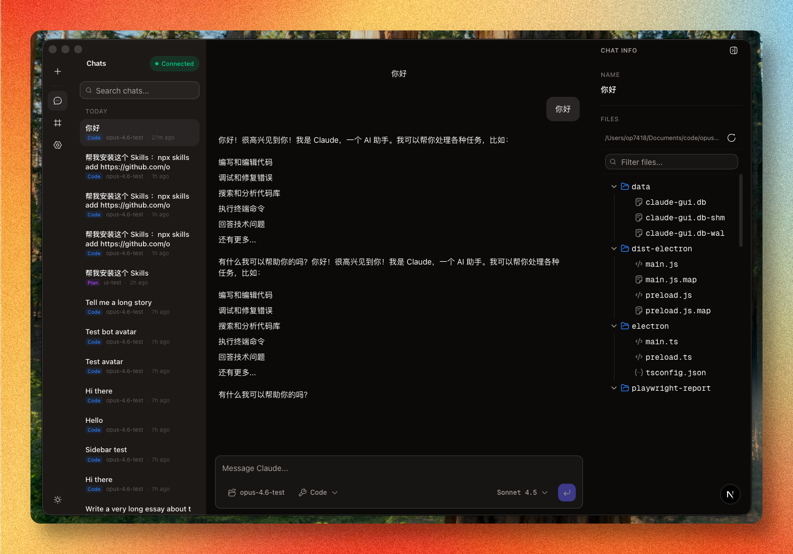

 CodeAnywhere
===

**Claude Code 的 Web GUI 客户端** -- 通过精美的可视化界面进行对话、编码和项目管理，可在任何浏览器（包括移动端）访问。

[English](./README.md) | [日本語](./README_JA.md)

[](https://github.com/op7418/CodeAnywhere/releases)
[](https://github.com/op7418/CodeAnywhere/releases)
[](LICENSE)

---

## 功能特性

- **实时对话编码** -- 流式接收 Claude 的响应，支持完整的 Markdown 渲染、语法高亮代码块和工具调用可视化
- **会话管理** -- 创建、重命名、归档和恢复聊天会话。所有对话本地持久化存储在 SQLite 中，重启不丢失
- **项目感知上下文** -- 为每个会话选择工作目录。右侧面板实时展示文件树和文件预览，随时了解 Claude 正在查看的内容
- **可调节面板宽度** -- 拖拽聊天列表和右侧面板的边缘调整宽度，偏好设置跨会话保存
- **文件和图片附件** -- 在聊天输入框直接附加文件和图片。图片以多模态视觉内容发送给 Claude 进行分析
- **权限控制** -- 逐项审批、拒绝或自动允许工具使用，可选择不同的权限模式
- **多种交互模式** -- 在 *Code*、*Plan* 和 *Ask* 模式之间切换，控制 Claude 在每个会话中的行为方式
- **模型切换** -- 在对话中随时切换 Claude 模型（Opus、Sonnet、Haiku）
- **MCP 服务器管理** -- 直接在扩展页面添加、配置和移除 Model Context Protocol 服务器。支持 `stdio`、`sse` 和 `http` 传输类型
- **自定义技能** -- 定义可复用的提示词技能（全局或项目级别），在聊天中作为斜杠命令调用
- **设置编辑器** -- 可视化和 JSON 编辑器管理 `~/.claude/settings.json`，包括权限和环境变量配置
- **Token 用量追踪** -- 每次助手回复后查看输入/输出 Token 数量和预估费用
- **PWA 安装** -- 在移动端或桌面端添加到主屏幕，获得类原生体验
- **深色/浅色主题** -- 导航栏一键切换主题
- **斜杠命令** -- 内置 `/help`、`/clear`、`/cost`、`/compact`、`/doctor`、`/review` 等命令
- **Token 鉴权** -- 设置 `AUTH_TOKEN` 环境变量，在网络暴露时保护你的实例
- **安全防护头** -- 自动设置 CSP、X-Frame-Options、速率限制等安全 HTTP 头

---

## 截图



---

## 环境要求

> **注意**：CodeAnywhere 底层调用 Claude Code Agent SDK。请确保 `claude` 命令在 `PATH` 中可用，并且已完成认证（`claude login`）。

| 要求 | 最低版本 |
|------|---------|
| **Node.js** | 18+ |
| **Claude Code CLI** | 已安装并完成认证（`claude --version` 可正常运行） |
| **npm** | 9+（Node 18 自带） |

---

## 快速开始

```bash
# 克隆仓库
git clone https://github.com/op7418/CodeAnywhere.git
cd CodeAnywhere

# 安装依赖
npm install

# 以开发模式启动
npm run dev
```

然后打开 [http://localhost:3000](http://localhost:3000)。

---

## 部署

### Docker（推荐用于自托管）

```bash
# 复制并配置环境变量
cp .env.example .env
# 在 .env 中设置 AUTH_TOKEN 以保护你的实例

# 使用 Docker Compose 启动
docker compose up -d
```

应用将在 `http://localhost:3000` 上运行。

### 远程访问（Cloudflare Tunnel）

从外部网络访问本地运行的 CodeAnywhere：

1. 注册 [Cloudflare](https://dash.cloudflare.com/) 账号并添加域名。
2. 进入 [Zero Trust](https://one.dash.cloudflare.com/) → Networks → Tunnels → 创建隧道。
3. 复制 Tunnel Token，并将公共主机名指向 `http://nginx:80`。
4. 配置 `.env`：

```bash
cp .env.example .env
# 填写 ANTHROPIC_API_KEY、AUTH_TOKEN、CLOUDFLARE_TUNNEL_TOKEN
```

5. 使用隧道模式启动：

```bash
docker compose -f docker-compose.tunnel.yml up -d
```

你的实例将通过配置的 Cloudflare 域名提供服务，自动启用 HTTPS。

### 独立 Node.js 运行

```bash
npm run build
npm run start
```

### 环境变量

| 变量 | 说明 | 默认值 |
|------|------|--------|
| `AUTH_TOKEN` | 访问应用所需的 Bearer Token。不设置则禁用鉴权（仅本地使用）。 | 未设置 |
| `PORT` | HTTP 端口 | `3000` |
| `CLOUDFLARE_TUNNEL_TOKEN` | Cloudflare Tunnel 令牌（仅用于 `docker-compose.tunnel.yml`）。 | 未设置 |

---

## 技术栈

| 层级 | 技术 |
|------|------|
| 框架 | [Next.js 16](https://nextjs.org/)（App Router，standalone 模式） |
| PWA | Service Worker + Web App Manifest |
| UI 组件 | [Radix UI](https://www.radix-ui.com/) + [shadcn/ui](https://ui.shadcn.com/) |
| 样式 | [Tailwind CSS 4](https://tailwindcss.com/) |
| 动画 | [Motion](https://motion.dev/) |
| AI 集成 | [Claude Agent SDK](https://www.npmjs.com/package/@anthropic-ai/claude-agent-sdk) |
| 数据库 | [better-sqlite3](https://github.com/WiseLibs/better-sqlite3)（嵌入式，用户独立） |
| Markdown | react-markdown + remark-gfm + rehype-raw + [Shiki](https://shiki.style/) |
| 流式传输 | Server-Sent Events |
| 图标 | [Hugeicons](https://hugeicons.com/) + [Lucide](https://lucide.dev/) |
| 部署 | [Docker](https://www.docker.com/) |
| CI/CD | [GitHub Actions](https://github.com/features/actions) |

---

## 项目结构

```
codeanywhere/
├── .github/workflows/      # CI/CD：Web 构建 + Docker
├── public/
│   ├── manifest.json        # PWA Web App Manifest
│   ├── sw.js                # Service Worker
│   └── icons/               # PWA 图标
├── src/
│   ├── app/                 # Next.js App Router 页面和 API 路由
│   │   ├── login/           # Token 登录页面
│   │   ├── chat/            # 新建对话页面和 [id] 会话页面
│   │   ├── extensions/      # 技能 + MCP 服务器管理
│   │   ├── settings/        # 设置编辑器
│   │   └── api/             # REST + SSE 接口
│   │       ├── chat/        # 会话、消息、流式传输、权限
│   │       ├── files/       # 文件树和预览
│   │       ├── plugins/     # 插件和 MCP 增删改查
│   │       ├── settings/    # 设置读写
│   │       ├── skills/      # 技能增删改查
│   │       └── tasks/       # 任务追踪
│   ├── components/
│   │   ├── ai-elements/     # 消息气泡、代码块、工具调用等
│   │   ├── chat/            # ChatView、MessageList、MessageInput、流式消息
│   │   ├── layout/          # AppShell、NavRail、Header、MobileDrawer、RightPanel
│   │   ├── plugins/         # MCP 服务器列表和编辑器
│   │   ├── project/         # FileTree、FilePreview、TaskList
│   │   ├── skills/          # SkillsManager、SkillEditor
│   │   └── ui/              # 基于 Radix 的基础组件（button、dialog、tabs...）
│   ├── hooks/               # 自定义 React Hooks
│   ├── lib/                 # 核心逻辑
│   │   ├── auth.ts          # Token 验证和客户端存储
│   │   ├── api-client.ts    # authFetch 封装
│   │   ├── claude-client.ts # Agent SDK 流式封装
│   │   ├── db.ts            # SQLite 数据库、迁移、CRUD
│   │   ├── files.ts         # 文件系统工具函数
│   │   ├── permission-registry.ts  # 权限请求/响应桥接
│   │   └── utils.ts         # 通用工具函数
│   ├── middleware.ts         # 鉴权中间件（路由保护）
│   └── types/               # TypeScript 接口和 API 类型定义
├── Dockerfile
├── docker-compose.yml
├── package.json
└── tsconfig.json
```

---

## 开发

```bash
# 运行 Next.js 开发服务器
npm run dev

# 生产构建
npm run build

# 启动生产服务器
npm run start
```

### 说明

- 聊天数据存储在 `~/.codeanywhere/codeanywhere.db`。如果存在旧版 `~/.codepilot` 目录，首次启动时会自动迁移。
- 应用使用 SQLite WAL 模式，并发读取性能优秀。
- Service Worker 缓存静态资源并为应用提供离线访问能力。API 路由不会被缓存。

---

## 贡献

欢迎贡献代码。开始之前：

1. Fork 本仓库并创建功能分支
2. 使用 `npm install` 安装依赖
3. 运行 `npm run dev` 在本地测试你的更改
4. 确保 `npm run lint` 通过后再提交 Pull Request
5. 向 `main` 分支提交 PR，并附上清晰的变更说明

请保持 PR 聚焦 -- 每个 PR 只包含一个功能或修复。

---

## 许可证

MIT
